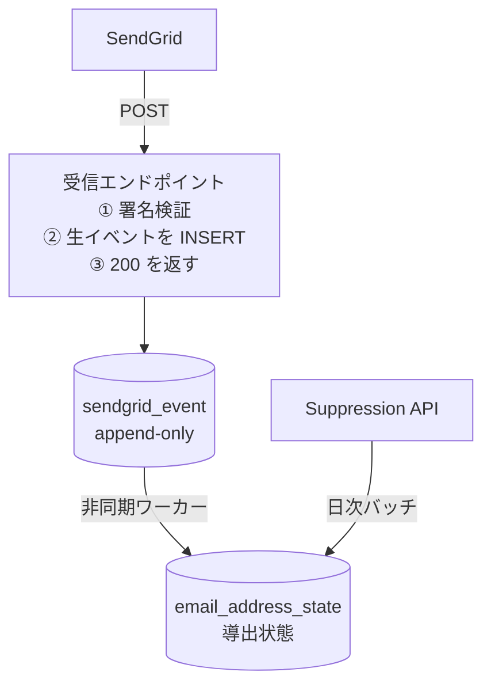

# recibir

SendGrid Event Webhook の受信リファレンス実装。
Kotlin / Spring Boot 4.1 / jOOQ / PostgreSQL。

> **これはリファレンス実装です。**
> ライブラリではありません。依存として追加するのではなく、読んで、必要な部分を
> 自分のコードベースに持っていくことを想定しています。
> 設計意図が伝わる状態で完成とみなしており、**機能追加は行いません**。
> コミットが止まっていても、それは放置ではなく完成を意味します。

*A reference implementation of a SendGrid Event Webhook receiver, written in Kotlin
with Spring Boot 4.1, jOOQ and PostgreSQL. Not a library — read it, take what you need.
Feature-complete by design; see [CONTRIBUTING.md](CONTRIBUTING.md).*

---

## 解こうとしている問題

SendGrid の送信 API が `202 Accepted` を返しても、それは「キューに積んだ」以上の意味を
持ちません。宛先に届いたかどうかは一切保証されない。実際の配信結果は Event Webhook
経由で非同期に届きます。

この非同期性が、素朴に実装すると壊れる原因を三つ持ち込みます。

1. **イベントは重複する。** 同じイベントが複数回 POST される
2. **順序は保証されない。** `delivered` の後に `processed` が届くことがある
3. **取りこぼす。** 受信側の障害中に発生したイベントは、リトライ上限を超えると失われる

さらに、抑制リスト（過去にバウンスした宛先など）に載ったアドレスは以降ずっと
`dropped` になります。アプリ側がこれを知らないと、**送信 API は 202 を返し続けるのに
永久に届かない**という、最も気づきにくい障害が発生します。

recibir はこの四つに対する一つの答えです。

## 設計

この図は処理の流れだけを示します。**テーブル定義は載せません**——
カラムと型は [docs/SPEC.md](docs/SPEC.md) §3、
テーブル間の関係は [docs/er.md](docs/er.md) が正本です。

読み取ってほしいのは 2 点。**受信エンドポイントが署名検証と INSERT で終わっている**こと。
そして **導出状態へ入る経路が Webhook と Suppression API の 2 本ある**ことです。
図の後の各節は、なぜこの形にしたかを書いています。



### 受信と解釈を分ける

受信エンドポイントは「壊れずに全部受け取る」ことだけに責任を持ちます。
バウンス判定とアプリ側のステータス更新は、すべて後段の非同期処理です。
**通知は recibir の外です**——下の「気づく」を参照してください。

これは 200 を返すまでを短く保つためでもありますが、より本質的には
**単発イベントで状態遷移させると必ず壊れる**からです。重複と順序の乱れがある以上、
「このアドレスに送っていいか」は全イベントを見て決めるしかありません。

### 生 JSON を捨てない

`sendgrid_event.payload` には受信した JSON をそのまま保持します。
SendGrid はフィールドを予告なく追加してくるので、DTO に射影した時点で捨てた情報は
二度と戻りません。生を残しておけば、解釈ロジックのバグは後から再処理で直せます。

`email_address_state` は生イベントからいつでも再構築できる二次テーブルです。

### Webhook を信頼しない

日次で Suppression API と突き合わせます。Webhook の取りこぼしは起きる前提です。

- `GET /v3/suppression/bounces`
- `GET /v3/suppression/blocks`
- `GET /v3/suppression/invalid_emails`
- `GET /v3/suppression/spam_reports`

### 気づく

構造化ログを 1 行の JSON で stdout へ出します。**アプリから外部へは送信しません。**
転送先も発報の条件も運用側が持ちます。レート制限・重複抑制・ミュートは監視基盤の仕事で、
アプリに書けばそれを全部自作することになります。

読み取ってほしいのは、**最も深刻な障害が配信失敗の通知では捕まらない**ことです。

受信側を検証対応にする前に SendGrid 側で署名検証を有効化すると、全イベントが 403 で
弾かれます（下の「動かす」の注記）。このときアプリは正常に動き、ログは静かで、DB も
壊れていません。ただイベントが 1 件も入らない。そして配信失敗の通知は 1 通も飛びません
——失敗イベントを受信していないからです。

**通知が来ないことが「配信が全部成功している」なのか「Webhook が全部弾かれている」なのか
区別できない。** これは冒頭で挙げた、送信 API が 202 を返し続けるのに永久に届かないという
障害と同じ形をしています。

だから受信のたびに `webhook.received` を出します。**一定時間これが来ていないこと**を
監視の条件にできれば、途絶に気づけます。**何かが起きたときに出るログではなく、
何も起きていないときにも出るログが要る**、ということです。

出すログの一覧と、`severity` を監視基盤の語彙に合わせた理由は
[docs/SPEC.md](docs/SPEC.md) §4.7 にあります。

---

## 実装上、踏み抜きやすい箇所

このリポジトリを読む価値があるとすれば、おそらくここです。

### 生バイト列を確保する

署名の検証対象は `timestamp + rawBody` です。JSON をパースして再シリアライズした
ものではキー順や空白が変わって絶対に一致しません。`@RequestBody rawBody: ByteArray`
で受けること。フィルタチェーンの途中でボディを消費されていないかも要確認です。

### `sg_message_id` はそのまま使えない

送信時のレスポンスヘッダ `X-Message-Id` が `abc123` なら、Webhook 側では
`abc123.filterdrecv-xxxx-yyy.1` の形で届きます。`.` の前で切れば一致しますが、
この形式に依存するのは危うい。

送信時に `custom_args` へ自前の `job_id` を入れておくのが確実です。
**これは過去の送信に遡って付けられません。**

### OAuth を有効にする場合のエラーボディ

SendGrid は一度取得したアクセストークンをキャッシュして使い回します。
期限切れ・不正トークンを検知させるには、4xx を返すだけでなく
**レスポンスボディに** `invalid_request` / `invalid_token` / `insufficient_scope`
のいずれかの文字列を含める必要があります。

Spring Security 標準の `BearerTokenAuthenticationEntryPoint` は
`WWW-Authenticate` ヘッダにしか error を載せず、ボディは空です。そのままだと
SendGrid はトークンを取り直さず、401 を出し続けたままイベントが失われます。

### 200 と 500 の切り分け

SendGrid は非 2xx を再送します。DB 障害時に 200 を返すとイベントは永久に失われ、
逆に自分側のバグ（パース不能など）で 500 を返し続けると再送が積み上がります。
**インフラ障害は 500、自分側のバグは 200 で受け切って退避**、という分岐が要ります。

---

## 動かす

```bash
docker compose up -d          # PostgreSQL
./gradlew flywayMigrate       # スキーマ適用（jOOQ codegen の前提）
./gradlew jooqCodegen         # jOOQ コード生成。通っていないと永続化層はコンパイルできない
./gradlew build
SENDGRID_WEBHOOK_PUBLIC_KEY=<SendGrid が配る公開鍵> \
  SENDGRID_API_KEY=<Suppression API を読める API キー> \
  ./gradlew bootRun
```

SendGrid は公開 URL にしか POST しないため、ローカル開発では
ngrok / Cloudflare Tunnel などでトンネルを張ってください。

設定は `sendgrid.webhook.public-key` と `sendgrid.api.key` の 2 つです。
前者は SendGrid 管理画面の `Settings > Mail Settings > Signed Event Webhook Requests`
で署名検証を有効化すると表示され、後者は Suppression API との突き合わせが使います。

**受信だけを試す場合も、両方が要ります。** 片方で起動できるようにすると、
突き合わせが動かないまま「動いているつもり」になれてしまいます。

**既定値は置いていないので、鍵を渡さないと起動しません。** 空で起動できるようにすると、
設定を忘れたまま全イベントを 403 で弾き続けることになり、それは「解こうとしている問題」が挙げた
**最も気づきにくい障害**と同じ形になります——通知は 1 通も飛ばず、ログも静かなままです。

> **順序に注意:** 受信側を検証対応にしてから SendGrid 側で有効化してください。
> 逆にすると全イベントが 403 で弾かれます。

テストは SendGrid アカウントなしで通ります。署名検証のテストは
EC P-256 の鍵ペアをテスト内で生成し、自己署名して検証する構成です。

---

## 前提と制約

| 項目 | 前提 |
|---|---|
| JDK | 25 |
| Spring Boot | 4.1（Jackson 3 / `spring-boot-starter-webmvc`） |
| DB | PostgreSQL のみ |
| jOOQ | Spring Boot の BOM が決める |

PostgreSQL 以外に載せ替える場合、**jOOQ のライセンスを確認してください。**
jOOQ はデュアルライセンスで、オープンソース DB では Apache License 2.0、
商用 DB（Oracle、SQL Server など）では商用ライセンスが必要になります。

`jsonb` と `ON CONFLICT` に依存しているため、他 DB への移植は
スキーマ設計から見直しが必要です。対応する予定はありません。

---

## ライセンス

Apache License 2.0 — [LICENSE](LICENSE) を参照してください。

Copyright PROPAGANDIST CORPORATION

SendGrid および Twilio は Twilio Inc. の商標です。本プロジェクトは
Twilio Inc. とは無関係であり、公式に承認されたものではありません。

---

## 作っているところ

[PROPAGANDIST CORPORATION](https://propagandist.co.jp) — 横浜のシステム開発会社です。
