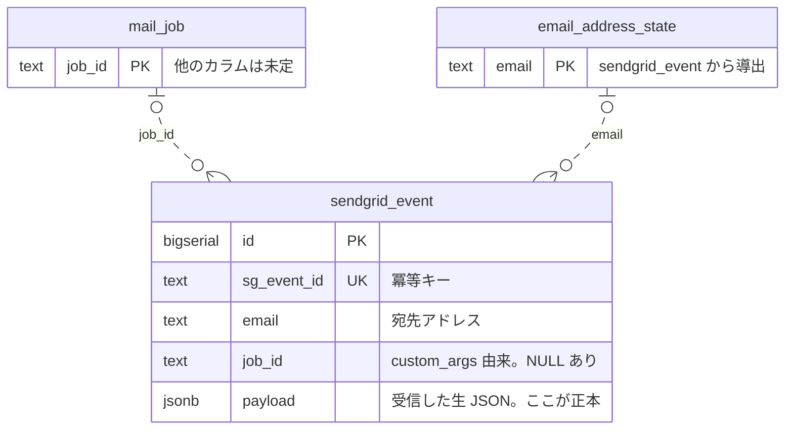

# ER 図 — recibir

この図はテーブル間の関係を示す。**カラム定義は載せない**——全カラムと型は
[SPEC.md](SPEC.md) §3 の表が正本である。ここに出るのは主キー・一意キーと、
テーブルをまたぐカラムだけ。

読み取ってほしいのは 2 点。**どれが正本で、どれが捨てて作り直せる二次テーブルか**。
そして **なぜ外部キー制約が 1 つも無いか**。

## 凡例

**破線は論理的な対応であり、DB 上の外部キー制約ではない。** 理由は次節に書く。

多重度はどちらの関連も両端が `0` を許す。これは図の主張なので、根拠を挙げる。

| 端 | 多重度 | 根拠 |
|---|---|---|
| `mail_job` | 0..1 | `job_id` は送信時に `custom_args` へ入れるもので、遡って付けられない。**入っていないイベントがある** |
| `email_address_state` | 0..1 | 射影は非同期（`EventProjector`）。**まだ状態行が生えていないイベントがある** |
| `sendgrid_event` | 0..N | `SuppressionReconciler` が Suppression API を正として補完する。**対応するイベントが 1 件も無い状態行がありうる** |

3 行目は取りこぼしの跡である。Webhook を受け損ねたアドレスは、日次の突き合わせで
状態だけが先に立つ（[SPEC.md](SPEC.md) 4.5）。

## なぜ外部キー制約を張らないか

受信エンドポイントは、署名を検証して `INSERT` を 1 回打ち、200 を返すまでで終わる。
**業務判断を一切しない**のが設計の要である（[SPEC.md](SPEC.md) 4.2 / 4.3）。

外部キー制約は、これと噛み合わない。上の表の 3 つが、そのまま親行の不在を意味するからである。

**制約を張れば、親行の不在が受信の失敗になる。** SendGrid は非 2xx を再送するので、
親行が永遠に生えない組み合わせでは再送だけが積み上がる。受信側に落ち度が無いのに、
イベントは入らないまま失われる。

だから対応は破線で描く。**張り忘れではなく、張らない判断である。**

## 正本は `sendgrid_event`

`payload` に受信した生 JSON をそのまま置く。SendGrid はフィールドを予告なく足すので、
DTO へ射影した時点で捨てた情報は戻らない。生を残せば、解釈のバグは後から再処理で直せる。

`email_address_state` はここから導出する二次テーブルであり、いつでも捨てて作り直せる。
図が `email` を破線で結んでいるのは参照ではなく、**この導出の向き**を示している。

単発のイベントで状態を上書きしない。イベントは重複し、順序も乱れる。
「このアドレスへ送ってよいか」は全イベントを見て決まる（[SPEC.md](SPEC.md) 4.4）。

## `mail_job` のカラムが未定な理由

[SPEC.md](SPEC.md) 3.3 は「最小限のスキーマのみ提供する」とだけ書き、カラムを定めていない。
メール送信そのものは §2「含まない」に入る。

図には枠と `job_id` だけを置く。**ここを埋めるのは、送信側を書く人の仕事である。**
